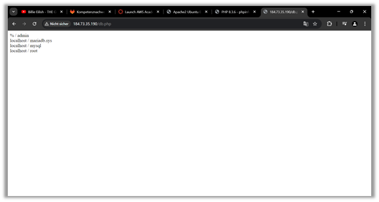

# KN03
## a) Installation von Web und Datenbankserver
Hiet wird die Instanz aus KN02 verwendet. Webserver und eine Datenbank auf dem Ubuntu server werden Installiert.

## b) Elastic Storage (EBS) hinzufügen
Elastic Block Storage (EBS) ist ein skalierbarer Speicher für Amazon EC2-Instanzen, der Daten unabhängig von der Lebensdauer einer Instanz speichert. Beim Erstellen einer EC2-Instanz wird standardmäßig ein 8-GB-Root-Volume zugewiesen. Für spezielle Anforderungen oder größere Datenmengen kann zusätzlicher Speicher hinzugefügt werden. In dieser Aufgabe fügen Sie Ihrer laufenden EC2-Instanz ein neues EBS-Volume hinzu.

### Auswahl eines Gerätennamens bei EBS Volumens
Bei der Auswahl eines Gerätenamens für EBS-Volumes ist Vorsicht geboten, um Konflikte zu vermeiden:

- Vermeiden überlappende Gerätenamen wie `/dev/xvdf` und `/dev/xvdf1`.
- Obwohl EBS-Volumes mit den gleichen Gerätenamen wie Instance-Speicher-Volumes verbunden werden können, wird davon abgeraten, da dies zu unvorhersehbarem Verhalten führen kann.
- Bei **Linux-Instanzen** kann der Gerätename durch den Kernel automatisch angepasst werden, obwohl der nachfolgende Buchstabe in der Regel gleich bleibt.
- Verwenden keine nachfolgenden Zahlen in Gerätenamen bei **HVM-AMIs** (außer `/dev/sda1` und `/dev/sda2`).
- Einige benutzerdefinierte Kernel haben Einschränkungen bezüglich der erlaubten Gerätenamen, wie etwa `/dev/sd[f-p]`.

Tools wie `lsblk` (Linux) oder „Datenträgerverwaltung“ (Windows) Nutzen, um die vorhandenen Geräte und Mount-Punkte zu überprüfen, bevor Sie einen neuen Namen zuweisen.

### Für was wird eine zusätzliche Virtuelle Disk verwendet werden können? 

Diese Flexibilität ermöglicht es, Ressourcen effizient zu verwalten und den Speicherbedarf je nach Anforderungen anzupassen.
Als Beispiel bei der Datenlagerung bei Grössere Datenmenge/ Datenbanken. Oder das Volumen wird verwendet zur Speicherung von Backups, um Datenverlust zu vermeiden zu können. Allgemein bei der Anwendung kann ich mir vorstellen, dass die Performance verbessert werden kann. Daten und Anwendungen werden auf separaten Volumens gespeichert, was zur schnellere Datenzugriff führt. 

