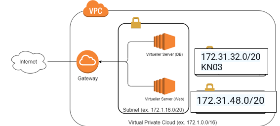
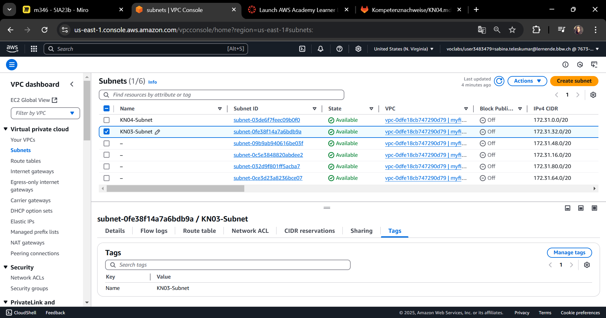
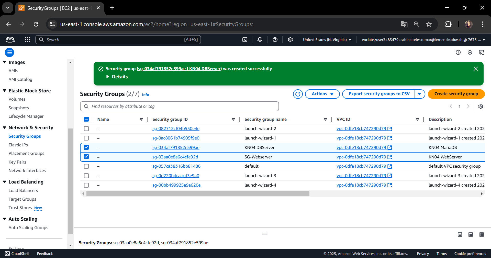
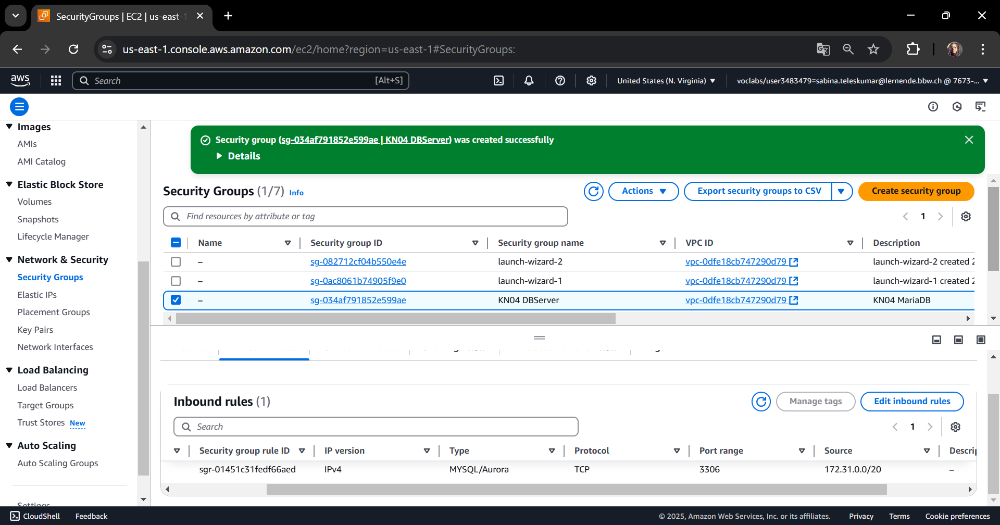
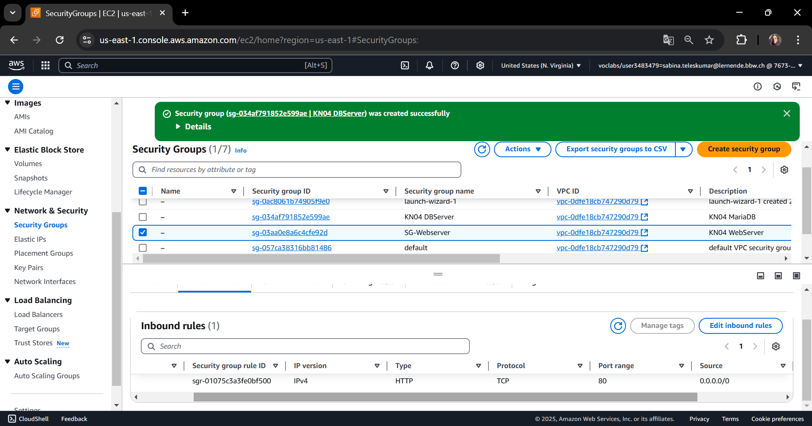
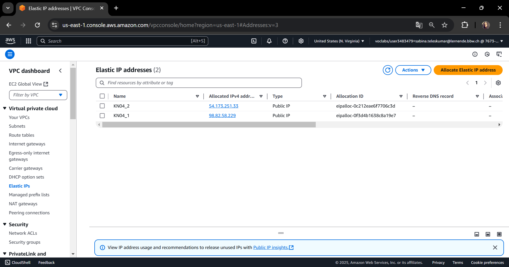

# KN04
## A) Diagramm erstellen (10%)

-Erklärung was ist ein VPC?

VPC steht für Virtual Privat Cloud. Das bezeichnet das eigenes internes  virtuelles Netzwerk innerhalb des Anbieters, sind globale Ressourcen. Jedes VPC Netzwerk besteht aus einem oder mehreren IP-Adressenbereichen, die als Subnetzt bezeichnet werden. 
-Erklärung Was ist ein Subnetz? 

Ein Subnetz ist ein Bereich von IP-Adressen. In diesem fall in der VPC. Subnetz sind regionale Ressourcen, denen IP-Adressbereiche zugeordnet sind. 

## B) Subnetz und private IP wählen (10%)

Web-Server IP: 172.31.0.10
DB-Server IP: 172.31.0.20

## C) Objekte und Instanzen erstellen (80%)
### 1.Sicherheitsgruppen 

### 2.Öffentliche, statische IPs

### 3.Netzwerk Interface 

