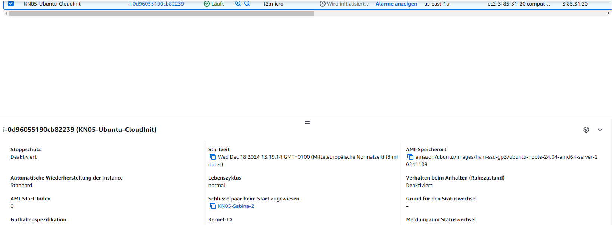
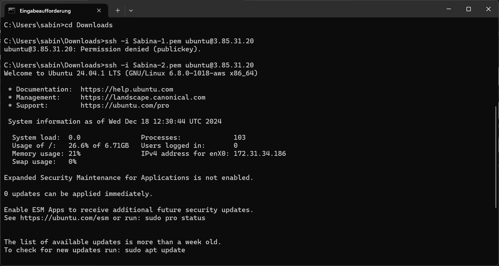
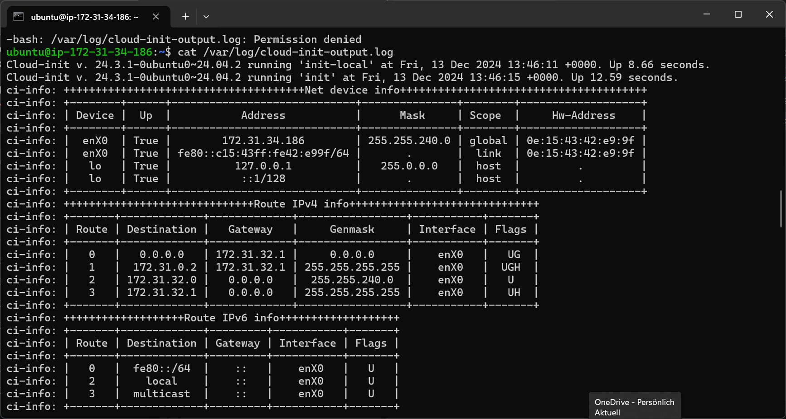

# KN05
## B) SSH-Key und Cloud-init (15%)

YAML ist eine einfache Textdatei mit einer definierten Syntax. https://yaml.org/ 
Wie ein json file; objekt mit key-velues

Cloud-init biete eine Konfiguration des Betriebssystem während der Installation. 
Szenario: 10 Server installieren mit verschiedene Betriebssystemen (Ubuntu, Redhat), alle benötigen die gleiche Konfiguration betreffend Software/Pakete. 
Entweder: 
•	Alle Server einzeln instaliieren und alle Pakete installieren und die verschiedene Befehle ausführen. 
•	Ein Bash-Script erstellen, welche alle Befehle ausführt. Nur noch ausführen. (Aufwand das Skript auf alle Server zu laden und auszuführen)
•	Eine Konfiguration-Datei erstellen und diese bei der Installation der Instanz mitgeben. (Keine weitere Schritte sind notwendig) 

https://cloudinit.readthedocs.io/en/latest/ 

