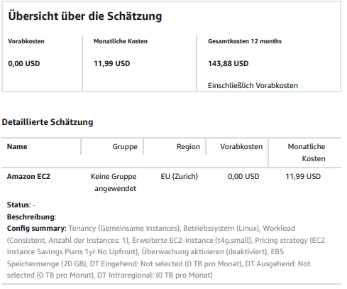
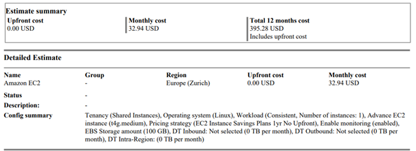
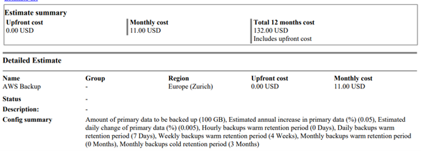
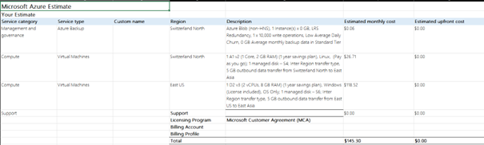

# KN10
## a) Kostenbrechenung IAAS - Rehosting (60%)
Für die Option Rehosting beschränkt sich die Firma auf die beiden public cloud Anbieter AWS und Azure.

##WEb-Server AWS

- Der t4g.small-Server wurde ausgewählt, da er mit 2 vCPUs und 2 GB RAM die Anforderungen unseres bisherigen Webservers vollständig abdeckt. Diese Konfiguration bietet ausreichend Leistung für unsere Anwendung, während sie gleichzeitig kosteneffizient bleibt. Die Entscheidung  des EC2 Instance Savings Plans (1 Jahr, keine Vorauszahlung) ermöglicht Kosteneinsparungen, ohne die Flexibilität zu stark einzuschränken.
  
##DB-Server AWS

 
 - Für den Datenbankserver wurde der t4g.medium-Instance-Typ gewählt, da er mit 2 vCPUs und 4 GiB RAM ideal auf die Anforderungen unserer aktuellen Datenbank abgestimmt ist. Die Konfiguration bietet ausreichend Leistung und Speicher für unsere Anwendung und Benutzeranzahl.  Zusätzlich wurden 100 GB EBS-Speicher für die Datenbank bereitgestellt, was dem bisherigen Bedarf entspricht. Monitoring wurde aktiviert, um die Performance der Datenbank besser überwachen zu können.

##BackUp AWS

 
 -Die Konfiguration für das Backup-System wurde so gewählt, um ein Gleichgewicht zwischen Kosten und Datensicherheit zu erreichen:

Primärdaten (100 GB)
Der Wert basiert auf der aktuellen Größe der Datenbank. Wir berücksichtigen dabei nur die tatsächlich genutzten Daten, nicht den gesamten bereitgestellten Speicher, um Kosten zu optimieren.

Geschätzter jährlicher Zuwachs (5%)
Dieser moderate Wert deckt potenzielle Datenwachstumsraten ab, da die Datenbank in einer stabilen Umgebung betrieben wird.

Tägliche Änderungen (0.5%)
Dies entspricht dem Branchenstandard für Änderungen an Datenbanken, um tägliche Backups effizient zu planen.

Warm Storage für tägliche und wöchentliche Backups

Tägliche Backups: Für 7 Tage behalten, um kurzfristige Wiederherstellungen zu ermöglichen.
Wöchentliche Backups: Für 4 Wochen aufbewahrt, um im Falle größerer Probleme Zugriff auf Wochenstände zu haben.
Cold Storage für monatliche Backups

Monatliche Backups werden für 3 Monate im günstigeren Cold Storage (z. B. Glacier) aufbewahrt, um Langzeitaufbewahrungskosten niedrig zu halten.
Diese Auswahl stellt sicher, dass Daten sowohl kurzfristig schnell verfügbar als auch langfristig kosteneffizient gesichert sind.

##Das gleiche mit Azure

 

 -Azure Backup (Blob Storage): Eine kostengünstige Lösung für tägliche Backups mit minimalen Änderungen (Low Average Daily Churn), was nur $0.06 pro Monat kostet. LRS (Locally Redundant Storage) bietet eine gute Verfügbarkeit ohne hohe Kosten.

Web Server (A1 v2 VM): Diese Instanz (1 Core, 2 GB RAM) wurde ausgewählt, um die Webanwendung kostengünstig zu betreiben. Sie ist für leichte Workloads geeignet und erfüllt die Anforderungen des Webservers. Mit einem 1-Jahres-Savings-Plan bietet sie einen Rabatt und senkt die Kosten auf $26.71 pro Monat.

DB Server (D2 v3 VM): Diese Instanz (2 vCPUs, 8 GB RAM) wurde für den DB-Server gewählt, da sie für moderate bis schwere Workloads besser geeignet ist. Die 1-Jahres-Savings-Plan-Auswahl für $118.52 pro Monat sorgt für ein gutes Preis-Leistungs-Verhältnis bei den höheren Anforderungen eines DB-Servers.
 
## b) Kostenbrechenung PAAS - Replattforming (20%)
Ihre Firma möchte Heroku als PAAS Plattform evaluieren. Verwenden Sie den Heroku Kostenrechner um eine Schätzung der Kosten zu erstellen.

 
 

