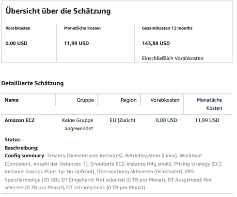
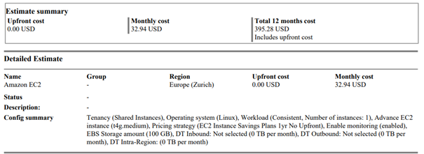

# KN10
## a) Kostenbrechenung IAAS - Rehosting (60%)
Für die Option Rehosting beschränkt sich die Firma auf die beiden public cloud Anbieter AWS und Azure.

##WEb-Server 

- Der t4g.small-Server wurde ausgewählt, da er mit 2 vCPUs und 2 GiB RAM die Anforderungen unseres bisherigen Webservers vollständig abdeckt. Diese Konfiguration bietet ausreichend Leistung für unsere Anwendung, während sie gleichzeitig kosteneffizient bleibt. Die Entscheidung für eine 1-Jahres-Verpflichtung wurde getroffen, um deutliche Einsparungen zu erzielen, ohne die Flexibilität für zukünftige Anpassungen zu verlieren. Linux wurde ausgewählt da Ubuntu auf Linux lauft. 

##DB-Server

 ##DB-Server 
 
 
 

