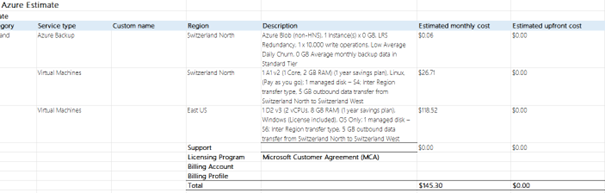

# KN10
## a) Kostenbrechenung IAAS - Rehosting (60%)
Für die Option Rehosting beschränkt sich die Firma auf die beiden public cloud Anbieter AWS und Azure.

##WEb-Server AWS

Der t4g.small-Server wurde ausgewählt, da er mit 2 vCPUs und 2 GB RAM die Anforderungen unseres bisherigen Webservers vollständig abdeckt. Diese Konfiguration bietet ausreichend Leistung für unsere Anwendung, während sie gleichzeitig kosteneffizient bleibt. Die Entscheidung  des EC2 Instance Savings Plans (1 Jahr, keine Vorauszahlung) ermöglicht Kosteneinsparungen, ohne die Flexibilität zu stark einzuschränken.
  
##DB-Server AWS

 
  Für den Datenbankserver wurde der t4g.medium-Instance-Typ gewählt, da er mit 2 vCPUs und 4 GiB RAM ideal auf die Anforderungen unserer aktuellen Datenbank abgestimmt ist. Die Konfiguration bietet ausreichend Leistung und Speicher für unsere Anwendung und Benutzeranzahl.  Zusätzlich wurden 100 GB EBS-Speicher für die Datenbank bereitgestellt, was dem bisherigen Bedarf entspricht. Monitoring wurde aktiviert, um die Performance der Datenbank besser überwachen zu können.

##BackUp AWS

 
 -Die Konfiguration für das Backup-System wurde so gewählt, um ein Gleichgewicht zwischen Kosten und Datensicherheit zu erreichen:

Primärdaten (100 GB)
Der Wert basiert auf der aktuellen Größe der Datenbank. Wir berücksichtigen dabei nur die tatsächlich genutzten Daten, nicht den gesamten bereitgestellten Speicher, um Kosten zu optimieren.

(ChatGPT)
Geschätzter jährlicher Zuwachs (5%)
Dieser moderate Wert deckt potenzielle Datenwachstumsraten ab, da die Datenbank in einer stabilen Umgebung betrieben wird.

(ChatGPT)
Tägliche Änderungen (0.5%)
Dies entspricht dem Branchenstandard für Änderungen an Datenbanken, um tägliche Backups effizient zu planen.

Warm Storage für tägliche und wöchentliche Backups

Tägliche Backups: Für 7 Tage behalten, um kurzfristige Wiederherstellungen zu ermöglichen.
Wöchentliche Backups: Für 4 Wochen aufbewahrt, um im Falle größerer Probleme Zugriff auf Wochenstände zu haben.
Cold Storage für monatliche Backups

Monatliche Backups werden für 3 Monate im günstigeren Cold Storage (z. B. Glacier) aufbewahrt, um Langzeitaufbewahrungskosten niedrig zu halten.
Diese Auswahl stellt sicher, dass Daten sowohl kurzfristig schnell verfügbar als auch langfristig kosteneffizient gesichert sind.

##Das gleiche mit Azure

 

 -Azure Backup (Blob Storage): Eine kostengünstige Lösung für tägliche Backups mit minimalen Änderungen (Low Average Daily Churn), was nur $0.06 pro Monat kostet. LRS (Locally Redundant Storage) bietet eine gute Verfügbarkeit ohne hohe Kosten.

Web Server (A1 v2 VM): Diese Instanz (1 Core, 2 GB RAM) wurde ausgewählt, um die Webanwendung kostengünstig zu betreiben. Sie ist für leichte Workloads geeignet und erfüllt die Anforderungen des Webservers. Mit einem 1-Jahres-Savings-Plan bietet sie einen Rabatt und senkt die Kosten auf $26.71 pro Monat.

DB Server (D2 v3 VM): Diese Instanz (2 vCPUs, 8 GB RAM) wurde für den DB-Server gewählt, da sie für moderate bis schwere Workloads besser geeignet ist. Die 1-Jahres-Savings-Plan-Auswahl für $118.52 pro Monat sorgt für ein gutes Preis-Leistungs-Verhältnis bei den höheren Anforderungen eines DB-Servers.
 
## b) Kostenbrechenung PAAS - Replattforming (20%)
Ihre Firma möchte Heroku als PAAS Plattform evaluieren. Verwenden Sie den Heroku Kostenrechner um eine Schätzung der Kosten zu erstellen.

WebServer
 

Für den Webserver wird der Standard 2x Dyno gewählt, da dieser mit 1 Core und 1 GB RAM pro Dyno ausgestattet ist. Um die geforderten 2 GB RAM des On-Premise-Webservers zu erreichen, werden zwei dieser Dynos eingesetzt. Diese Konfiguration bietet nicht nur die notwendige Rechenleistung und Speicherkapazität, sondern erhöht durch Load Balancing die Ausfallsicherheit und verbessert die Lastverteilung. Zudem bleibt die Lösung kostengünstiger als der Einsatz eines größeren Performance-Dynos, während sie die bestehende Infrastruktur effizient ersetzt.

## DB-Server
 
 
 
 

Diese Konfiguration bietet dedizierte CPU-Leistung und ausreichend Arbeitsspeicher für stabile Performance. Zwei dieser Dynos erfüllen die Anforderungen des On-Premise-Datenbankservers (2 Cores, 4 GB RAM). So wird die notwendige Rechenleistung sichergestellt, und die DB-Verfügbarkeit bleibt hoch.
Der Plan ist kostengünstiger als höhere Varianten (Shield-L) und erfüllt die Spezifikationen effizient.

## C) Kostenrechnung SAAS - Repurchasing (10%)
Ihre Firma möchte zwei SAAS Lösungen evaluieren Schauen Sie sich die  Zoho CRM oder SalesForce Sales Cloud Anbieter an.

Der Backup ist imbegriffen in diesen zwei angebote

##Web Server + Backup

- Für die einfache Umgebung wurde dies reichen.

##DB Server + Backup

Da bei der Db einiges mehr verändert angepasst wierd empfehle ich dies.

##Das gleiche mit Zaho

Professional für 

Webserver – Zoho CRM Professional Plan (€23/user/month): Dieser Plan wurde ausgewählt, weil er alle Funktionen des Standard-Plans bietet und zusätzlich wertvolle Tools wie Blueprint, CPQ, SalesSignals, und Google Ads Integration enthält. Diese Funktionen ermöglichen eine effiziente Verwaltung von Arbeitsabläufen, verbessern die Nutzererfahrung und integrieren Marketingmaßnahmen, was für den Webserver wichtig ist.

Datenbankserver – Zoho CRM Enterprise Plan (€40/user/month): Der Enterprise Plan wurde aufgrund seiner erweiterten Funktionen wie Zia (KI-Assistant), Territory Management, Custom Modules, Custom Functions, und Sandbox gewählt. Diese bieten die nötige Flexibilität und Skalierbarkeit für komplexere Datenbankanforderungen und ermöglichen eine präzise Steuerung der Datenverarbeitung und -analyse.

##Interpretation der Resultate (10%)
Ich haben nun 5 mögliche Varianten (AWS, Azure, Heroku, Zoho, SalesForce) und konkrete Schätzungen dazu.  Stellen Sie die verschiedenen Lösungen gegenüber betreffend

Bei IAAS muss man am meisten Anwenden, und kostet auch am Meiste. Dafür ist alles so definiert wie man es genau möchte. 

Bei PAAS ist günstiger als IAAS da alles in der Cloud ist. Das aber hier ist, das es abhängig von dem Anzahl und grösse der Dynos ist.durch externe Programme werden sie schnell teurer. Der Aufwand für die Firma ist ein wenig weniger Aufwenig als IAAS, weil der Anbieter bei PaaS die Infrastruktur, Wartung und Skalierung übernimmt, während du bei IaaS für die komplette Verwaltung der Infrastruktur verantwortlich bist.

SAAS ist sehr sehr günstig. Da der Ambieter alles Wartet und macht. Also man selbst kann keine eigene Server oder andere Ressoursen einrichten. Es ist auch sehr einfach gehalten. 
